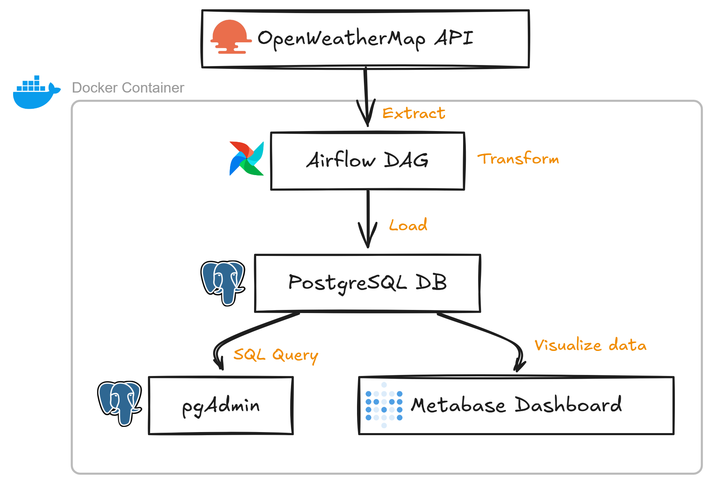

# 🌦️ Weather Data Pipeline with Airflow, Docker, Postgres & Metabase

This is an end-to-end data pipeline that fetches daily weather data for major INDIAN cities using the OpenWeatherMap API, stores it in a PostgreSQL database via Apache Airflow, and visualizes it using Metabase.

---

## 🛠️ Tech Stack

- **Airflow** (ETL Orchestration)
- **PostgreSQL** (Data Warehouse)
- **Docker Compose** (Containerized Infra)
- **Metabase** (Visualization)
- **pgAdmin** (DB GUI)

---

## 🧱 Architecture Overview

---

### 🚀 Features

- Fetches real-time weather data for major Indian cities using lat/lon
- Inserts weather data into a normalized Postgres schema
- Automates and schedules via Airflow
- Easy setup using Docker Compose
- Clean dashboard via Metabase

---

### Visual architecture

  

---

## Credits
Credits to  [Chiranjeevi Sagi](https://github.com/chiranjeevi-sagi)
